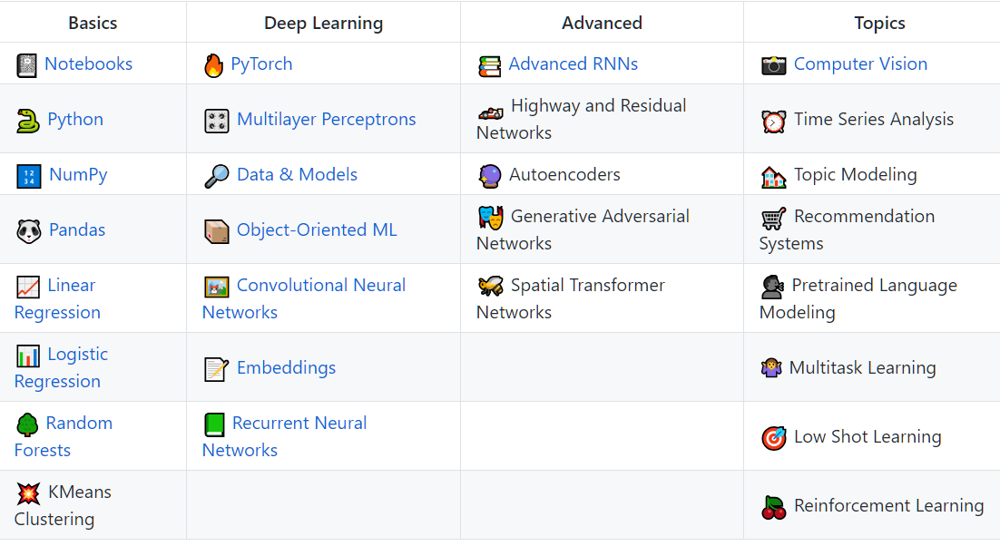

# All

#### Homemade Machine Learning
Python examples of popular machine learning algorithms with interactive Jupyter demos and math being explained
* Link: https://github.com/trekhleb/homemade-machine-learning

#### PracticalAI
A set of well-written code for Machine Learning and Data Science. It includes Numpy, Pandas, Random Forests, RNN, CNN, Computer Vision, etc. It's special in that its codes are well organized per Object-Oriented norm that can be directly used out of the box.
* Link: https://github.com/GokuMohandas/practicalAI
* Chinese Version: https://github.com/MLEveryday/practicalAI-cn

#### 100-Days-Of-ML-Code
100 Days of Machine Learning Coding.
* Link: https://github.com/Avik-Jain/100-Days-Of-ML-Code
* Chinese Version: https://github.com/MLEveryday/100-Days-Of-ML-Code
* Datasets used: https://github.com/Avik-Jain/100-Days-Of-ML-Code/tree/master/datasets

#### 60_Days_RL_Challenge / 强化学习60天
Learn Deep Reinforcement Learning in Depth in 60 days
* Link: https://github.com/andri27-ts/60_Days_RL_Challenge
* Chinese Version: https://github.com/MLEveryday/60_Days_RL_Challenge

#### Mindmap: Machine Learning Mindmap / Cheatsheet
A Mindmap summarising Machine Learning concepts, from Data Analysis to Deep Learning.
* Link:https://github.com/dformoso/machine-learning-mindmap
* Download the PDF here: https://github.com/dformoso/machine-learning-mindmap/blob/master/Machine%20Learning.pdf
* Same, but with a white background: https://github.com/dformoso/machine-learning-mindmap/blob/master/Machine%20Learning%20-%20White%20BG.pdf

#### Mindmap: Data Science for Managers 
* Description: https://activewizards.com/blog/intro-to-data-science-for-managers-mindmap/?utm_source=reddit&utm_medium=programming&utm_campaign=ds_mindmap
* Source File: https://coggle.it/diagram/WypjBWlbpEHkyhcg/t/data-science-for-managers/c0083ef2d003b849535618df0b84e6dad73e301910c45e7eab5b72ff12f016e0

Data science is incredibly broad and complex discipline, an interception of computer science, math and statistics, and a domain of knowledge requiring the understanding the source of data: medical, financial, web, and other domains. The mindmap below contains a condensed introduction to the key data science concepts and techniques that have revolutionized the business landscape and became essential for making beneficial data-driven decisions. We are confident that it will be useful and informative for both the data science managers and for those facing this rapidly developing field as a client or user.

### Numpy 
**NumPy** is an extension library for Python language, supporting operations of a large number of high-dimensional arrays and matrices. In addition, it also provides a large number of mathematical function libraries for array operations. Machine learning involves a lot of transformations and operations on arrays, which makes NumPy one of the essential tools.

#### 100 NumPy Exercises
* Link: https://labex.io/lab/403

Despite its name of "exercises", it's essentially a cheatsheet containing 100 most-frequent usage. 

It is divided into _basic part_ and _advanced part_, each with 50 exercises. The basic part of the exercise helps you familiarize yourself with the use of NumPy's common methods and the advanced part focuses on the combined application of the NumPy methods. 

### PyTorch

#### PyTorch Tutorials
* Link: https://pytorch.org/tutorials/
* Source Code Repo: https://github.com/pytorch/tutorials
It uses sphinx-gallery's notebook styled examples to create the tutorials

#### Implementing an Image Classifier with PyTorch
by Jose Nieto
* Part 1: https://medium.com/udacity/implementing-an-image-classifier-with-pytorch-part-1-cf5444b8e9c9
* Part 2: https://medium.com/udacity/implementing-an-image-classifier-with-pytorch-part-2-ae4dd7b2f48

### DataFrame Visualization

#### Pandas 

....

#### Vaex: 

Out of Core Dataframes for Python and Fast Visualization

### Speech Recognition

#### Project DeepSpeech
* made by Mozilla
* available in [pip](https://pypi.org/project/deepspeech/) and [npm](https://www.npmjs.com/~deepspeech)
* Github: https://github.com/mozilla/DeepSpeech

#### Kaldi
* written in C++, and wrapped by Bash and Python
* http://kaldi-asr.org/doc/
* https://github.com/kaldi-asr/kaldi

#### Wav2Letter++
* made by Facebook Research
* https://github.com/facebookresearch/wav2letter
* https://arxiv.org/abs/1812.07625

#### DeepSpeech2
* https://github.com/PaddlePaddle/DeepSpeech

#### Julius
* supports both English and Japanese languages only
* https://github.com/julius-speech/julius
